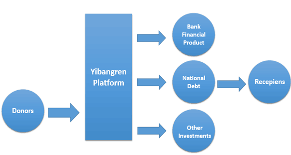
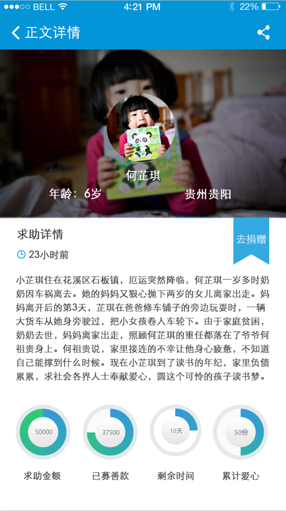

# A Transparent P2P Platform for Charitable Donations
## Background
The project is a competition project [(The Eleventh “Citicup” Financial Innovation Competition)](http://www.citigroup.com/china/csts/EducationProgram/AboutEducation_CFCcn.html#tab3).It gained the National Finals Second Prize.

## Business Plan
### Project overview
YiBangRen——totally transparent P2P donation platform, recipients and donors can be connected through the platform directly. It helps solve the problem of asymmetric in-formation in donation transactions. The P2P aid model is similar to Taobao’s C2C e-commerce model.
### Market analysis and position
With economic development, China's charitable donations market continued to grow rapidly in recent years, while the traditional charitable foundations facing prob-lems like insufficient credibility, inefficiency, not open and transparent, network con-struction is lagging behind other issues, people are increasingly inclined to the Internet-oriented  person to person contributions.  However, there are many fraud, abuse dona-tion news in terms such kind of person to person donation. That is because donors lack a convenient donation platform, which can provide feedback and play a supervisory role in the Internet.

### Product
* Product forms:  website, Android version APP, IOS version APP, and Wechat   pub-lic account, Sina microblog account. 

* Donation Process

1.  Submit the information of asking for help to get verified. 
2.	 Donors donate money online. 
3.	 Donations flow into the public accounts, recipients need to submit the           ap-plication before extracting donations to indicate each purpose.
### Business model

1.  Early profit model is to charge corporation fees and advertising fees to enter-prises who seek for Cause Marketing and Corporate Social Responsibility. 
2.	After the formation of large cash flow, profit can be made through the precipi-tation of funds. 
3.	After building the Foundation, the huge cash flow can be used for low-risk in-vestments. 

### Marketing Strategy

 1.	By encouraging mechanisms to achieve projects and product spread through interpersonal relations between the user. 
 2.	Stars and other public figures ‘contributions through this platform can bring excellent fan effect.
 3.	Hot concerned projects such as the abducted female teachers contribute to im-prove visibility. 

## Project Link
[**Project Video**](http://www.iqiyi.com/w_19rsy9x459.html)

## Project Display
* **Poster**

* **Main UI**

